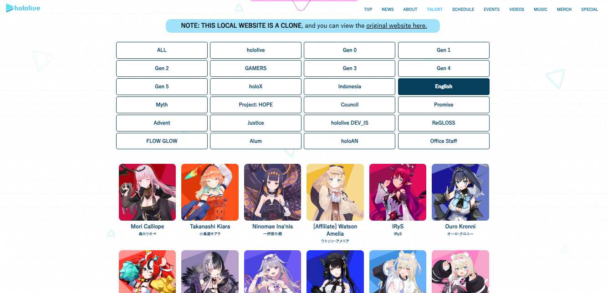
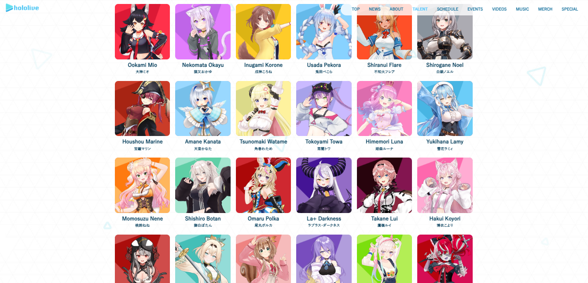

# Hololive Clone

This project was developed for educational purposes using Angular. The interface is a faithful replica of the website, 'Hololive Talent'. This website is a CLONE, the concept and images are not original creations; They belong to the original website, [Hololive Talent](https://hololive.hololivepro.com/en/talents).

This is the interface to display the information from [Hololive Clone API](https://github.com/HAndres8/Hololive-Clone-API) in an organized manner.

### Screenshots
- Selecting a Generation

  

- Selecting a Branch

  

- Selecting all Talents

  

## Development server
This project was generated with [Angular CLI](https://github.com/angular/angular-cli) version 16.0.3.

Run `ng serve` for a dev server. Navigate to `http://localhost:4200/`. The application will automatically reload if you change any of the source files.